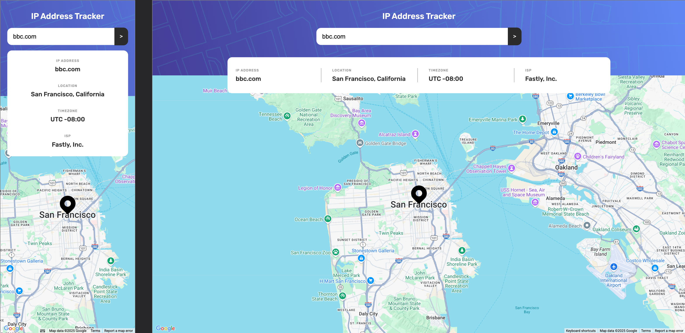
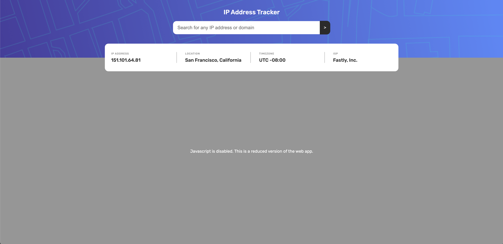

# Frontend Mentor - IP address tracker solution

This is a solution to the [IP address tracker challenge on Frontend Mentor](https://www.frontendmentor.io/challenges/ip-address-tracker-I8-0yYAH0). Frontend Mentor challenges help you improve your coding skills by building realistic projects.

## Table of contents

- [Overview](#overview)
  - [The challenge](#the-challenge)
  - [Screenshot](#screenshot)
  - [Live Site URL](#live-site-url)
- [My process](#my-process)
  - [Built with](#built-with)
  - [Continued development](#continued-development)
  - [Useful resources](#useful-resources)
- [Author](#author)

## Overview

### The challenge

Users should be able to:

- View the optimal layout for each page depending on their device's screen size
- See hover states for all interactive elements on the page
- See their own IP address on the map on the initial page load
- Search for any IP addresses or domains and see the key information and location
- No-JS version

### Screenshot

No-JS version

### Live Site URL

[https://ip-address-tracker-sandy-two.vercel.app/](https://ip-address-tracker-sandy-two.vercel.app/)

## My process

### Built with

- Remix
- React
- Typescript
- CSS modules
- Vitest
- Mock Service Worker (MSW)
- Google Maps

### Continued development

Due to timing limitation this is just a simple solution to achieve all the initial goals following good standards. However this could be extended by several ways. To be discussed in following sessions.

### Useful resources

- [Mock Service Worker](https://mswjs.io/) - Mock Service Worker is an API mocking library that allows you to write client-agnostic mocks and reuse them across any frameworks, tools, and environments.
- [Google Maps API](https://developers.google.com/maps) - API to use Google Maps in the site.

## Author

- Website - [Pablo Ibanez](https://pabloibanez.com/)
- Linkedin - [pablo-ibanez-dev](https://www.linkedin.com/in/pablo-ibanez-dev/)
- Github - [pabloibanezcom](https://github.com/pabloibanezcom)

